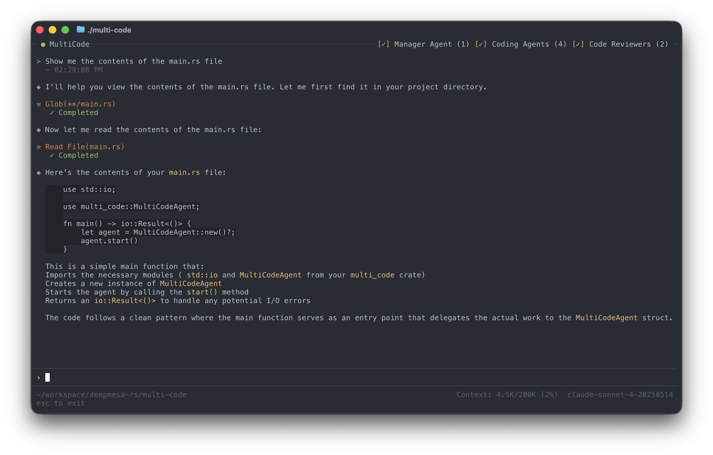

<p align="center">
  <picture>
    <source media="(prefers-color-scheme: dark)" srcset=".github/assets/logo-air-title.svg" />
    <source media="(prefers-color-scheme: light)" srcset=".github/assets/logo-air-title.svg" />
    
  </picture>
</p>

<h3 align="center">The Agentic AI Runtime</h3>
<h4 align="center">An Open Source SDK and Runtime for building AI Agents</h4>

<p align="center">
  <a href="https://github.com/deepmesa/agent-air/actions/workflows/ci.yml"></a>
  
  <a href="https://opensource.org/licenses/MIT"></a>
</p>

<h3 align="center"><a href="https://agent-air.ai">https://agent-air.ai</a></h3>

---

agent-air is an open-source SDK and Runtime for building AI agents running in a Terminal UI or on the server. agent-air handles everything you need: LLM communication, multiple sessions, markdown rendering, widgets & layouts, tools, skills, MCP, permissions and much more so you can focus on building your agent.

## Getting Started

Add agent-air to your `Cargo.toml`:

```toml
[dependencies]
agent-air = "0.7.0"
```

Build a working AI agent in just a few lines of code:

```rust
use agent_air::agent::AgentAir;
use agent_air::tui::AgentAirExt;

const SYSTEM_PROMPT: &str = "You are a helpful AI assistant.";

fn main() -> std::io::Result<()> {
    AgentAir::with_config("multi-code", "~/.config/my-agent", SYSTEM_PROMPT)?
        .into_tui()
        .run()
}
```

<p align="center">
  
</p>

## Features

- **High Performance Rust Core** - Async-first architecture powered by Tokio with zero-cost abstractions
- **Multi Model Architecture** - 75+ providers and 500+ models with runtime switching
- **Modular Architecture** - Terminal UI, Desktop, or Web-based frontends with event-driven API
- **Advanced Session Management** - Isolated concurrent sessions with independent history and tool registrations
- **Advanced Context Management** - Threshold-based, on-demand, or LLM-driven compaction strategies
- **Flexible Tool Management** - Custom tools with JSON schema and parallel batch execution
- **Powerful Permissions Framework** - Target + Level model with batch requests and recursive path grants
- **Streaming & Markdown Rendering** - Real-time SSE parsing with CommonMark-compliant rendering
- **Widget System** - Pre-built widgets: StatusBar, ChatView, TextInput, QuestionPanel, PermissionPanel, SessionPicker
- **Slash Command Framework** - Built-in and custom commands with interactive popup and real-time filtering
- **Agent Skills Support** - Modular skill system with reusable, composable behaviors
- **MCP Protocol** - Model Context Protocol support for external tool integrations
- **Custom Keybindings** - Standard and Emacs bindings with full KeyHandler trait for custom bindings
- **Error Recovery** - Graceful degradation with retries and actionable error messages

## Contributing

Contributions in any form (suggestions, bug reports, pull requests, and feedback) are welcome. If you've found a bug, you can submit an issue or email me at rsingh@arrsingh.com.

## License

This project is dual-licensed under the MIT LICENSE or the Apache-2 LICENSE:

- [Apache License, Version 2.0](http://www.apache.org/licenses/LICENSE-2.0)
- [MIT License](http://opensource.org/licenses/MIT)

#### Contribution

Unless you explicitly state otherwise, any contribution intentionally submitted
for inclusion in the work by you, as defined in the Apache-2.0 license, shall be
dual licensed as above, without any additional terms or conditions.

Contact: rsingh@arrsingh.com
